# 🌌 Shrenika Patil — Nebula Explorer

<div align="center">
  
</div>

<br />

---

<details>
  <summary>📡 Transceiver Text Logs (Plain Text Backup)</summary>

## 🌌 Captain's Log: Orbiting walchand-cse-starship

```text
=============================================================================
🛰️ VESSEL      : Walchand-CSE-Starship (B.Tech CSE, 2024 - 2028)
📍 COORDINATES : Sangli, Maharashtra, India | 16.8524° N, 74.5816° E
🌌 MISSION     : Architecting secure distributed sandboxes & real-time telemetry
⚡ RANK        : LeetCode Knight [1878 AP | Top 5% Globally]
=============================================================================
```

Hello, space explorer! I'm **Shrenika Patil**, a backend systems engineer and competitive programmer navigating the cosmos of distributed architectures, real-time communications, and secure containers.

---

## 🪐 The Planetary Sensor HUD (Projects Orbit)

*   **Planet Sandbox-IX** *(Distributed Interview Sandbox)*: Engineered secure **Docker execution cells** using Linux namespaces and `cgroups` (strict limits: `0.5 CPU core`, `128MB RAM`). Real-time **Socket.IO audio pipeline** with **Redis connection recovery** to safeguard packet delivery.
*   **Planet CareerGrid** *(Unified Education & Placement Grid)*: Decoupled MERN monolith elements into **FastAPI (Python) microservices** to isolate heavy CPU resume-parsing operations. Built low-latency WebSocket connections with Redis caching.
*   **Planet KisanSetu** *(Farm2Door Marketplace)*: Integrated a **Groq LLaMA voice assistant** to parse spoken vernacular inputs into structured listing coordinates. Optimized local route calculations using **MongoDB geospatial indexing**.

---

## 🛸 Starship Sub-Systems (Technical Skills)

*   **Languages:** C++, Python, JavaScript (ES6+), SQL
*   **Web & Real-Time Frameworks:** React.js, Node.js, Express.js, FastAPI, Socket.IO, WebSockets
*   **Databases & Queue Machinery:** MongoDB, PostgreSQL, Redis, BullMQ
*   **DevOps & Security:** Docker (Container Isolation), Git, Linux Shell, Helmet, bcrypt, Jest

---

## 📡 Transmission Frequency (Contact)
*   **LinkedIn:** [linkedin.com/in/shrenika-patil-2b2aa3330/](https://linkedin.com/in/shrenika-patil-2b2aa3330/)
*   **LeetCode:** [leetcode.com/u/shrenikapatil2/](https://leetcode.com/u/shrenikapatil2/)
*   **Email:** shrenikapatil0211@gmail.com

---

## 🏆 Fleet Commendations (Achievements)

*   **LeetCode Knight Badge:** Maximum rating of **1878** (Top 5% globally) with over 1000+ problems solved.
*   **CodeChef WCE Chapter:** *Main Secretary (2025 - 2026)*. Organized CP contests, increasing engagement by 35%.
*   **Reliance Foundation Scholar (2024):** National scholarship award recipient based on academic excellence.
*   **TechFiesta 2026 International Finalist:** Led team of 6 to the Top 60 out of 700+ teams globally.

</details>
